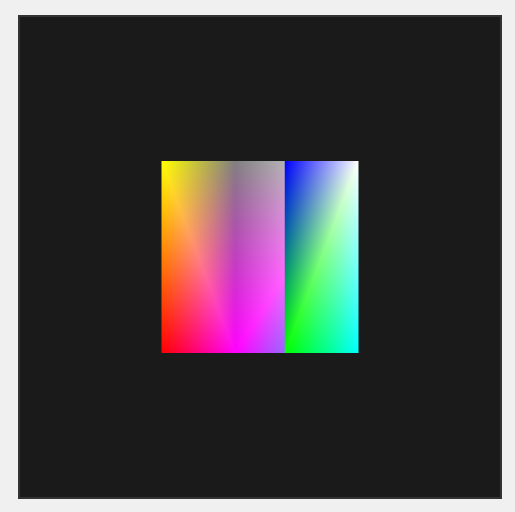

# Dioxus + WebGL Sample



Minimal Dioxus app that initializes a WebGL2 context and runs a basic render loop. Designed to run in the browser (WASM) with hot reload during development.

## Run (Web)

Start the development server:

```bash
dx serve
```
